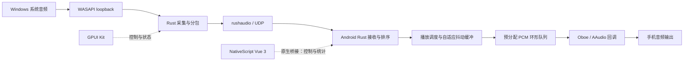

# 知更鸟 · Robin

Windows 桌面向 Android 手机串流系统音频。桌面使用 GPUI Kit，手机使用 NativeScript Vue 3 + Vite，两端使用 Rust 与 rushaudio 协议收发音频。已实现首版采集、加密传输、手机确认、设备发现与原生播放；10–30 ms 端到端延迟仍待真机测量。

## 已确定的范围

- 第一版：Windows → Android，单个桌面发送到单个手机。
- 仅深色主题。
- 自动发现手机；桌面可请求连接，手机也可输入电脑 IP 和端口主动连接，首次连接仍由手机确认。
- 桌面音频控制台与设备列表；手机播放和设置两页。
- 手机保存连接记录，并支持自动重连。
- 显示延迟、缓冲大小以及当前连接状态。
- 两端使用黑色主背景与紫色强调，不使用金色。

首版默认采集选定 Windows 输出设备的系统混音。多设备同步播放、单应用采集和其他平台作为后续扩展，不属于首版验收。

## 音频路径与职责



音频数据不经过 JavaScript。Android 通过 Kotlin/Java 包装与 JNI 调用 Rust；Oboe 是原生 C++ 播放后端，由 Rust 通过绑定或薄 C ABI 调用。具体绑定版本需要在 Android 交叉编译探针中确认。

采集、网络接收、排序和播放各自持有明确的生命周期。音频回调只读预分配队列、补齐缺失样本并更新轻量计数；不得分配内存、读取网络、写日志、等待锁或调用 JS。统计快照按低频推送到界面，例如每秒 4 次。

GPUI 视图拥有选择、焦点和界面临时状态；共享 Rust 服务拥有设备身份、会话、串流和统计状态。两端 UI 使用相同领域事件，不各自维护第二套连接状态机。

## rushaudio 的适用范围

2026-10-04 查阅的公开 crate 文档显示 1.1.0，协议采用 UDP，支持 PCM 与 Opus 标识，其公开延迟目标是 30–100 ms。已下载 crates.io 的 1.1.0 发布包核对以下实现，不仅依据 GitHub `main`：

- `JitterBuffer` 初始目标为 80 ms，初始最小延迟为 20 ms。只设置 `set_min_delay(10)` 并调用 `adapt_delay()` 时仍为 20 ms；同时设置最小值与最大值为 10，再调用 `adapt_delay()` 可以固定目标为 10 ms，已用发布包原始源码编译运行探针验证。
- 协议可以标识并承载 Opus 数据，但 `AudioCodecManager::encode/decode` 的 Opus 分支仅复制输入字节，没有实际压缩或解码；发布包的常规依赖也为空。因此「支持 Opus 传输」成立，「内置完整 Opus 编解码」不成立，需要另外接入真实编解码器。
- 协议头的媒体时间戳使用毫秒，不等同于跨设备同步后的绝对时间。

首版保留 rushaudio 协议与收发，采用 PCM S16LE；先验证其可配置缓冲是否能承担真实播放，再决定需要补充或替换的调度能力。Robin 负责播放期限、丢包处理与时钟漂移策略；不能仅因为缓冲配置为 10 ms 便宣称端到端满足目标。

### 10 ms 缓冲探针

2026-10-04 下载 crates.io 1.1.0 发布包，用 Rust 1.98.1 直接编译包内原始 `jitter.rs` 与 `constants.rs`，未修改库源码。验证结果：

| 配置                                      | 调整前目标 | `adapt_delay()` 后目标 |
| ----------------------------------------- | ---------- | ---------------------- |
| 仅 `set_min_delay(10)`                    | 80 ms      | 20 ms                  |
| `set_min_delay(10)` + `set_max_delay(10)` | 80 ms      | 10 ms                  |

```rust
let mut buffer = rushaudio::JitterBuffer::new();
buffer.set_min_delay(10);
buffer.set_max_delay(10);
buffer.adapt_delay(); // setter 本身不更新当前 target_delay
```

推入一个包后立即 `pop()` 返回 `None`；每约 200 微秒轮询，首次出队观测为 10.248 ms。出队后再调用五次 `adapt_delay()`，目标仍为 10 ms。该数字包含本机调度误差，只验证缓冲的等待与出队条件，不是网络或手机出声测量。

自适应公式先进行 `.max(20.0)`，再执行 `.clamp(min_delay, max_delay)`，因此最后的 10 ms 上限能覆盖中间的 20 ms 下限。但 `min=10/max=30` 不会形成完整的 10–30 ms 自适应范围，低抖动时仍从 20 ms 起步。上下限必须保持有序，启动前显式调用调整；这属于固定小缓冲策略，会牺牲吸收网络抖动的空间。

该实现按包的本地到达年龄判定可出队，还需要验证真实网络下的迟到包、序号回绕与媒体时间调度，不能将本地单包探针当作生产播放验证。

## 延迟目标与初始参数

10–30 ms 指桌面采集到手机实际出声的单向端到端延迟。工程上先验证 20–30 ms，10 ms 作为适配设备与优质网络下的挑战目标；不同手机、驱动和 Wi-Fi 条件不能统一保证。

初始实验条件：桌面有线接入路由器，手机连接同一局域网的 5 GHz/6 GHz Wi-Fi，手机使用内置扬声器或有线输出。蓝牙输出单独测量，不纳入首版低延迟验收。

| 项目             | 初始实验值 / 策略                                                |
| ---------------- | ---------------------------------------------------------------- |
| 传输格式         | 48 kHz、双声道、PCM S16LE；依据输出设备原生采样率协商与重采样    |
| 包时长           | 2.5 ms，即每声道 120 个采样，音频数据 480 字节                   |
| 音频净带宽       | 1.536 Mbit/s，不包含包头、链路开销或恢复冗余                     |
| UDP 大小         | 完整报文控制在 1200 字节以内，包括未来认证开销                   |
| 接收抖动缓冲     | 以 5–10 ms 为起始实验值，依据迟到包和欠载调整                    |
| Android 输出缓冲 | 按实际 frames-per-burst 设置，优先尝试双 burst，再依据 xrun 调整 |
| 音频回调         | 请求 LowLatency / Exclusive，记录系统实际授予模式，支持回退      |
| 网络异常         | 超过播放期限的音频丢弃；欠载短时补静音，不持续累积旧音频         |
| 时钟漂移         | 依据队列占用进行小幅速率修正，必要时在回调外重采样               |
| FEC              | 作为实验选项；不得为了等恢复包突破播放期限                       |

2.5 ms 网络包不意味着 WASAPI 能提供 2.5 ms 新数据。Windows loopback 工作在共享模式，实际采集周期需要记录，可能成为整个延迟预算的主要限制。

抖动缓冲与输出缓冲是不同队列，应分别计入延迟预算。稳定模式允许超过 30 ms，但界面要呈现实际状态，不能为了维持漂亮数字造成持续断音。

## 发现、确认与重连

手机使用 Android NSD 注册 `_robin._tcp` 服务（TCP 4211），桌面使用 mDNS 发现手机，同时提供 TCP 4212 接入端口与 `_robin-desktop._tcp` 服务。手机手动输入电脑 IP 与端口建立反向控制连接；音频端口在控制协商中确定，音频仍使用 rushaudio UDP。

1. 手机进入可被发现状态；桌面显示设备名、在线状态和兼容性。
2. 桌面选择发现的手机发送请求，或手机输入电脑 IP 和端口主动连接；手机显示电脑名称与身份核对信息。
3. 手机可选「拒绝」「允许一次」，以及明确的「信任此设备并允许自动重连」。
4. 允许后协商音频参数、认证会话和端口，再打开接收与播放。
5. 手机打开时自动开启接收，按保存的电脑地址重试并验证身份；每三秒尝试一条信任记录。地址变更需要手动更新；主动断开禁用该记录自动连接，关闭接收保留信任。

默认保存历史不等于授予永久信任。未信任设备需要再次确认；已经明确授权自动重连的设备可在授权有效期内恢复。用户主动断开后停止该会话重试，撤销信任后不能自动恢复。

身份采用持久设备 ID 与可验证密钥，不能只用 IP 或设备名称。控制会话需要身份验证；音频必须绑定已经允许的会话并验证来源，阻止未确认设备直接发送 UDP 后播放。具体认证与加密封装在协议实现前确定，不自行设计密码算法。

状态至少区分：发现中、可连接、请求确认、协商中、缓冲中、播放中、重连中、已断开、被拒绝、不可兼容。协议握手成功不能替代用户确认。

后台播放与重连由 Android 原生服务持有，需覆盖前台服务、音频焦点、电话打断、耳机切换、网络变化与进程重启；不能依赖 Vue 页面仍然存活。

## 统计与延迟显示

| 显示项       | 含义                                                         |
| ------------ | ------------------------------------------------------------ |
| 网络 RTT     | 同一单调时钟上的请求/响应往返耗时                            |
| 预计播放延迟 | 使用时钟偏移估计、媒体采集时间与输出队列计算，并标明「估算」 |
| 接收缓冲     | 当前排队音频时长，辅助显示包数与每包时长                     |
| 输出缓冲     | 当前有效缓冲帧数、采样率和换算时长                           |
| 稳定性       | 迟到包、丢包、欠载、重连次数                                 |

不能把 RTT/2 显示成精确单向延迟。两端本地时钟不能直接相减；需要额外时间同步与带误差界的估计。rushaudio 的毫秒媒体时间戳可以配合控制层时间映射与采样计数，但不独立证明真实出声时间。

验收使用共同时间基准下的物理录音或回环测量，对照桌面参考输出与手机输出的脉冲；同时记录各内部阶段时间。报告 P50/P95/P99、网络条件、音频路由与测量误差。界面指标作为诊断，物理测试作为端到端证据。

## 黑紫音频控制台

两端统一使用黑色主背景和紫色强调，色值进入主题定义，GPUI 视图从语义 token 读取。

| 语义             | 色值      | 使用                       |
| ---------------- | --------- | -------------------------- |
| Background       | `#09090D` | 主背景                     |
| Surface          | `#131119` | 播放器与信息区域           |
| Primary          | `#A78BFA` | 主要操作、波形、选中与焦点 |
| Foreground       | `#F5F3FF` | 正文                       |
| Muted foreground | `#A5A2B4` | 次要文字                   |
| Border           | `#30243F` | 区域边界                   |

桌面左侧为串流状态、真实音频电平、确认码和声音来源；右侧为附近手机和本机接入地址。删除星图、轨道和桌面手动地址输入，保留标准 Button 与 Select 的键盘交互。两个内容区域独立滚动，适配最小窗口。

手机仅有「播放」和「设置」两页。「播放」页将电脑名称与地址、实际 PCM 回调波形和播放控制合并为无外框区域，常驻 IP/端口手动连接、持久电脑记录和自动连接偏好，提供紧凑连接详情小卡片与连接加载动画；「设置」页集中接收开关、启动时开启接收和运行时缓冲调节。启动时开启接收默认启用，自适应缓冲默认关闭。连接详情展示确认缺包、迟到、欠载、RTT 和输出缓冲，记录最多五十条。首次允许后按加密身份保存授权；主动断开只停用自动连接，再次手动连接无需重复确认。

接收缓冲默认 20 ms，用户可动态调整到 5–100 ms。自动模式在欠载或迟到后增加 5 ms，稳定十秒后降低 1 ms直到用户下限；手动模式保持用户值。硬件输出缓冲独立依据 Oboe xrun 按 burst 增大。发送暂停后序号连续，区分未发送的媒体与实际网络缺包。

Android 原生前台服务持有媒体会话、音频焦点、唤醒锁与 Wi-Fi 锁，通知栏和媒体按键支持暂停、继续、关闭接收。临时失焦暂停输出并清理旧 PCM，恢复后重新预填充播放；永久失焦后需用户恢复。暂停不销毁加密连接，也不撤销信任。

## NativeScript 文档约束

用户提供的三份 Markdown 文档作为手机 UI 与生命周期的依据，实际 API 仍需对照安装版本的类型定义。

- **Multi-window**：文档介绍 NativeScript 9.1 的 `NativeWindow`，Android `Application.openWindow()` 标注为实验性。首版使用单窗口与页内确认，不将打开第二窗口作为连接流程。Activity 重建对应的 `detached` 不等于 `closed`；后台音频服务不随页面或窗口解绑而停止。固定深色主题时，应用主题不随窗口的系统外观事件切换。
- **连接记录**：记录上限五十条，使用按 fingerprint 保持身份的原生布局。实时波形和统计在播放页独立展示；记录行的切换与连接操作始终绑定当前电脑身份。
- **Button**：允许、拒绝、断开和重试使用原生 `Button`，以 `tap` 触发命令，以 `isEnabled` 表达可用状态，提供明确 `text` 与无障碍标签。请求处理中禁用重复提交；原生会话状态机仍负责幂等，不能只靠 UI 禁用防重复。

## 建议的实现顺序

1. **技术探针**：固定 rushaudio 版本，审计包结构、时间戳、缓冲和握手；验证 Android Rust + JNI + Oboe 构建；记录 WASAPI 采集周期。
2. **真实音频闭环**：手工地址、PCM、Windows loopback → 手机播放，实现有界队列、丢包与漂移处理，物理测量延迟。阶段完成前不宣称 10–30 ms。
3. **发现与确认**：mDNS/NSD、可验证身份、确认授权、会话保护、历史和重连；验证拒绝、过期、断开、网络变化与后台行为。
4. **两端 UI**：GPUI 音频控制台和 NativeScript Vue 3 播放器，接入真实服务状态，落实深色 token、键盘与减少动态效果。
5. **设备矩阵验收**：不同 Android 手机、网络负载、持续播放、锁屏、输出切换与断线恢复；依据 P95 与欠载决定默认缓冲。

建议初始目录为 `crates/robin-core`（会话、发现接口、传输与统计）、`crates/robin-desktop`（Windows 采集和 GPUI）、`crates/robin-mobile`（Rust 接收与播放）、`apps/mobile`（NativeScript Vue 3）和 `packages/nativescript-robin`（Android 原生桥）。这些是建议边界，当前不预建空包，也不删除现有 website starter。

## 已查阅来源

- [rushaudio crate 文档](https://docs.rs/crate/rushaudio/1.1.0)
- [rushaudio 抖动缓冲源码](https://github.com/OseMine/rushaudio/blob/main/src/audio/jitter.rs)
- [rushaudio codec 源码](https://github.com/OseMine/rushaudio/blob/main/src/audio/codec.rs)
- [rushaudio 协议](https://github.com/OseMine/rushaudio/blob/main/docs/protocol.md)
- [Microsoft WASAPI loopback](https://learn.microsoft.com/en-us/windows/win32/coreaudio/loopback-recording)
- [Android 低延迟音频指南](https://developer.android.com/games/sdk/oboe/low-latency-audio)
- [Android 网络服务发现](https://developer.android.com/develop/connectivity/wifi/use-nsd)
- [NativeScript Vue 3 应用入口](https://nativescript-vue.org/docs/getting-started/creating-an-application)
- [NativeScript multi-window](https://docs.nativescript.org/guide/multi-window.md)
- [NativeScript ListView](https://docs.nativescript.org/ui/list-view.md)
- [NativeScript Button API](https://docs.nativescript.org/api/classes/Button.md)

本地 GPUI Kit Coding Guides 与 Design Guides 作为桌面实现约束。Rust Android 原生库与 Vite 手机包已通过构建，桌面设备枚举与真实 WASAPI → 本地 UDP 采集探针已通过；手机真机播放与端到端延迟尚未测量。
